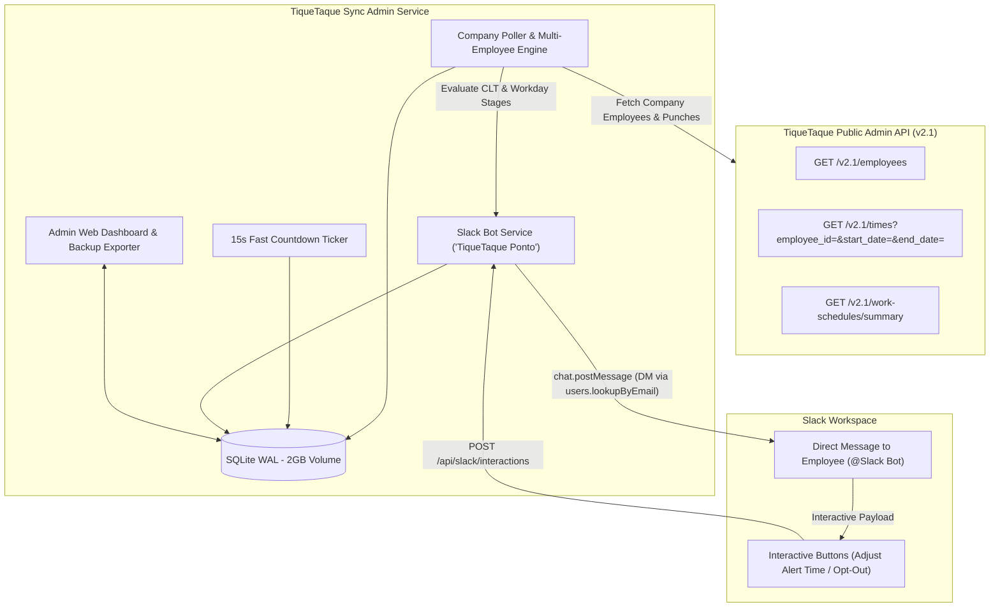

# ⏱️ TiqueTaque Sync Admin — Implementation Plan

## Goal
Build an enterprise-grade, lightweight open-source service that synchronizes workday punch records for an entire company via the TiqueTaque Public Admin API (v2.1) and dispatches personalized, interactive Slack direct messages ("TiqueTaque Ponto" bot) to employees, featuring a clean admin web dashboard for notification control, employee opt-in/opt-out, config backup/export, and a 2GB SQLite PVC for Kubernetes.

---

## Architecture Overview

---

## Tasks

- [ ] **Task 1: Project Foundation & Core Settings**
  - Scaffold project in `C:\git\resende\tique-taque-sync-admin`: `pyproject.toml`, `requirements.txt`, `.env.example`, `.gitignore`, `Dockerfile`, `docker-compose.yml`.
  - Implement `src/config.py` using Pydantic Settings supporting `TIQUETAQUE_ADMIN_TOKEN`, `SLACK_BOT_TOKEN`, `SLACK_SIGNING_SECRET`, polling intervals, and SQLite path.
  - *Verify:* `python -c "from src.config import settings; print(settings.model_dump())"` loads without errors.

- [ ] **Task 2: TiqueTaque Public Admin API Client (`src/tiquetaque/`)**
  - Implement `TiqueTaqueAdminClient` with BasicAuth (`public:<token>`).
  - Implement `get_employees()`, `get_employee_times(employee_id, date)`, and `get_work_schedules()`.
  - *Verify:* Live unit/integration test against sandbox API token returns 200 and parses active employees and times.

- [ ] **Task 3: Lightweight Database Layer with Backup Export (`src/database/`)**
  - SQLite schema with WAL mode:
    - `employees`: id, name, email, enabled, alert_lunch_minutes, alert_end_minutes, alert_clt_minutes, slack_user_id.
    - `dispatched_alerts`: employee_id, date, alert_type, sent_at.
    - `audit_logs`: timestamp, event, details.
  - Export/Import methods: JSON backup download and upload.
  - *Verify:* Automated tests for employee preference persistence, deduplicated alerts, and JSON export/import.

- [ ] **Task 4: Multi-Employee Workday & CLT Engine (`src/engine/`)**
  - Adapt `WorkdayEngine` to process batch employees asynchronously.
  - Track individual employee punch times, recalculate target end-of-shift, lunch warnings, and Art. 71 CLT continuous 6h rule.
  - *Verify:* Unit tests verify individual customized alert times (e.g. Employee A prefers 5m warning, Employee B prefers 15m warning).

- [ ] **Task 5: Slack Bot "TiqueTaque Ponto" (`src/slack/`)**
  - Slack Bot client with `users.lookupByEmail` caching to map employee emails to Slack user IDs.
  - Block Kit interactive templates with customizable warning buttons (5m, 10m, 15m, and Mute).
  - Webhook endpoint `/api/slack/interactions` to process button clicks and update employee preferences in SQLite.
  - *Verify:* Interactive action parser unit test correctly updates database settings from simulated Slack block action payload.

- [ ] **Task 6: Company Web Admin Dashboard (`src/web/`)**
  - Modern Glassmorphism Admin UI:
    - Employee list with notification toggle switch (enable/disable notifications per person).
    - Status badges (punches today, current stage, last alert sent).
    - Preference editor (default alert minutes per employee).
    - One-click "Export Config Backup (JSON)" and "Import Backup" button.
    - Trigger manual company-wide sync button.
  - *Verify:* FastAPI serves dashboard on `/`, API endpoints `/api/admin/employees`, `/api/admin/toggle/{id}`, and `/api/admin/backup/export` return valid data.

- [ ] **Task 7: Kubernetes Production Manifests with 2GB PVC (`k8s/`)**
  - `01-namespace.yaml` (`tique-taque-sync-admin`)
  - `02-configmap.yaml`
  - `03-secret.example.yaml`
  - `04-pvc.yaml` (2Gi PVC with `ReadWriteOnce`)
  - `05-deployment.yaml` (probes `/healthz`, non-root, 2Gi volume mount)
  - `06-service.yaml` & `07-ingress.yaml`
  - `kustomization.yaml`
  - *Verify:* `kubectl apply -k k8s/ --dry-run=client` validates cleanly without errors.

- [ ] **Task 8: Open Source Repository Artifacts (`README.md`, `AGENTS.md`)**
  - Write detailed `AGENTS.md` specifying Public Admin API v2.1, BasicAuth quirks, Slack interactive payloads, and data models.
  - Write comprehensive `README.md` with enterprise setup guide, Slack App manifest template, Docker Compose, and Kubernetes guide.
  - *Verify:* `git status` shows clean open-source project structure with no hardcoded credentials.

---

## Done When
- [ ] Multi-employee sync from TiqueTaque Public Admin API (`/v2.1/employees` and `/v2.1/times`) operates reliably.
- [ ] Slack Bot dispatches direct messages to employees by looking up their email with interactive Block Kit action buttons.
- [ ] Admin Web UI allows toggling employee notification status and exporting/importing JSON backups.
- [ ] 2GB PVC Kubernetes manifests validate cleanly.
- [ ] 100% automated test coverage on API client, DB, engine, and Slack interaction handlers.
